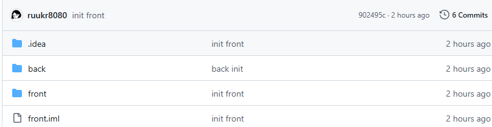

Oa_2024
---

안녕하세요 글지대 입니다.  이 프로젝트는 협업 툴 **오아_2024**입니다.

개요
---

*[오아]() 기능 1 설명  
[오아]() 기능 1 설명  
[오아]() 기능 1 설명  
[오아]() 기능 1 설명  
[오아]() 기능 1 설명 *

docs
---
[시장 분석]()  
[연구 자료]()  
[프로젝트 일지]()

---

# 향후 계획

**협업툴 Oa**를 첫번째 주요 상품으로.
향후 대규모 커뮤니티 집중 포털사이트를 개발하고 그 포털사이트의 첫번째 주력 서비스로 이용할겁니다.

포털사이트는 **지식**과 **블로그**를 합친 **지로그** 라는 이명을 가진 **오아시스 3.0**입니다.

---

